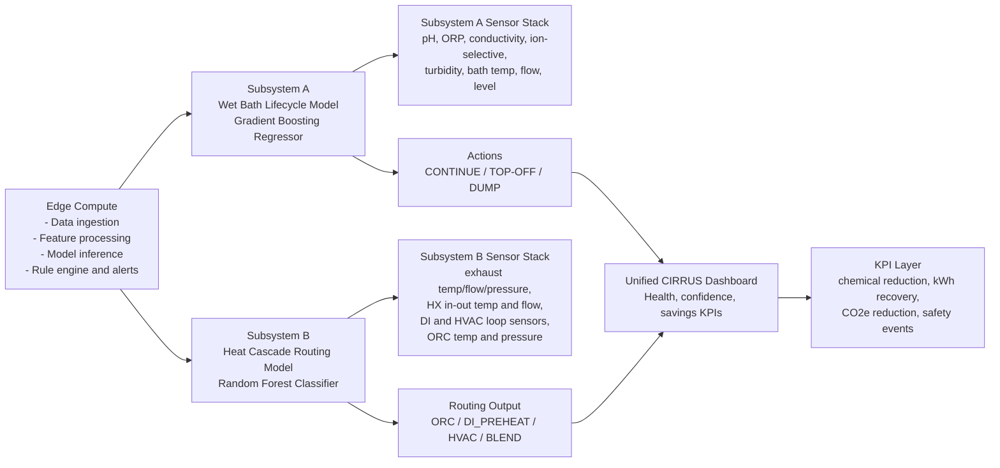

# CIRRUS Sensor Hardware and System Block Diagram

## 1) Sensor Hardware Requirements

### Subsystem A: Wet Bath Lifecycle Extension

Required sensors:
- Inline pH sensor
- Inline ORP sensor (oxidation-reduction potential)
- Conductivity sensor (ionic contamination proxy)
- Ion-selective sensor (for target ions, for example fluoride where applicable)
- Turbidity sensor (particulate contamination)
- Bath temperature sensor (RTD or thermocouple)
- Recirculation flow sensor
- Bath level sensor

Optional sensors:
- TOC sensor (total organic carbon)
- Dissolved oxygen sensor (chemistry-specific use cases)

Output used by model A:
- Remaining bath life percentage
- Action trigger: CONTINUE, TOP-OFF, or DUMP

### Subsystem B: Waste Heat Cascade Routing

Required sensors:
- Exhaust source temperature sensor (high-temperature thermocouple)
- Post-exchanger exhaust temperature sensor
- Exhaust flow sensor (mass or volumetric)
- Duct/static pressure sensor
- Heat exchanger inlet temperature sensor
- Heat exchanger outlet temperature sensor
- Heat exchanger primary-loop flow sensor
- DI preheat supply temperature sensor
- DI preheat return temperature sensor
- DI preheat loop flow sensor
- HVAC supply temperature sensor
- HVAC return temperature sensor
- HVAC loop flow sensor
- ORC evaporator/condenser temperature sensors
- ORC loop pressure sensors

Optional sensors:
- HVAC downstream humidity sensor
- Pump/fan vibration sensors (predictive maintenance)

Output used by model B:
- Routing decision: ORC_GENERATION, DI_PREHEAT, HVAC_SUPPLY, or BLEND
- Routing confidence distribution per class

### Shared Utility and Integration Instrumentation

Required meters and safety sensors:
- ORC electrical output power meter (kW/kWh)
- DI heater electrical power meter
- HVAC electrical power meter
- DI throughput water meter
- Utility-area ambient temperature and humidity sensor
- Leak detection sensors around chemical and thermal skids

Optional:
- Gas detection near exhaust interface where site EHS policy requires

---

## 2) System Block Diagram

---

## 3) Notes for Presentation

- Architecture starts with Edge Compute as the control center, then branches to Subsystem A and Subsystem B.
- Each subsystem consumes real-time sensor data and returns operational actions.
- Dashboard consolidates both subsystem outputs into one decision and reporting surface.
- This design keeps changes at facilities level and avoids modifications to critical process tools.
